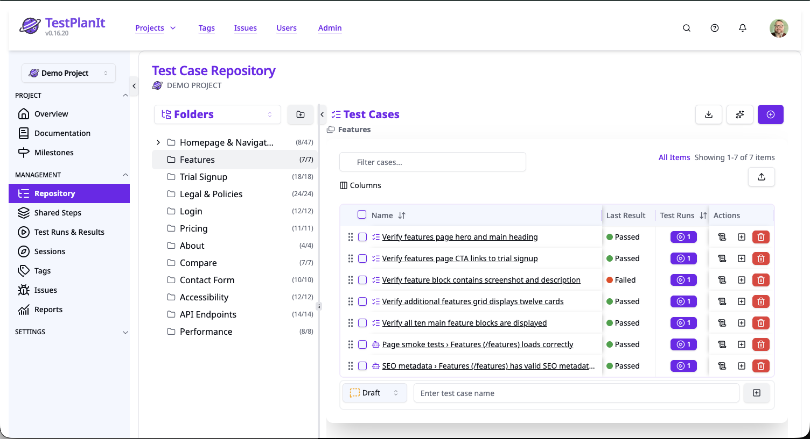
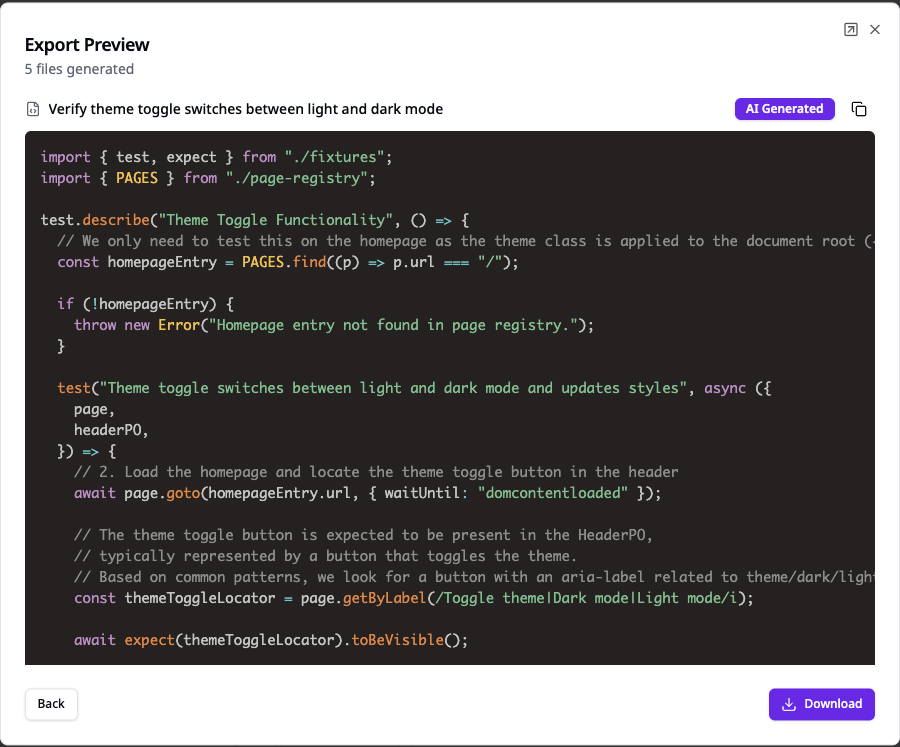
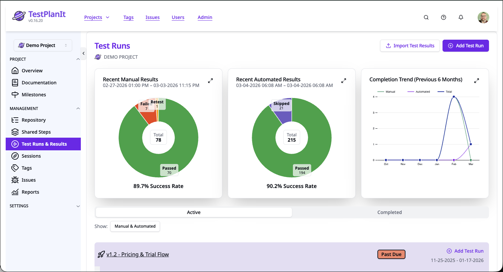
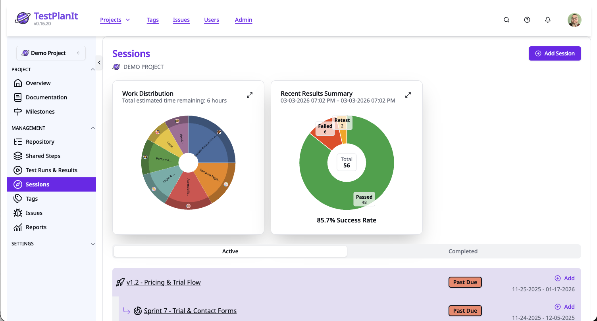
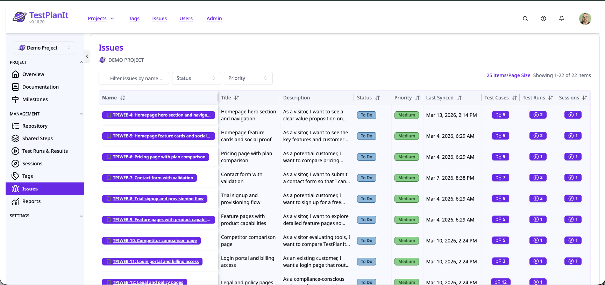
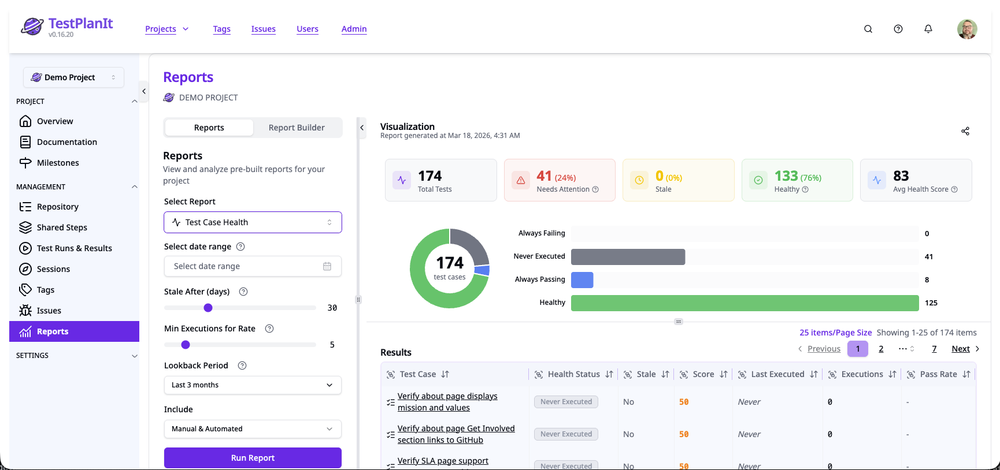

# TestPlanIt Monorepo

This monorepo contains the source code and related files for the TestPlanIt project.

## Screenshots

## Structure

This repository uses [pnpm workspaces](https://pnpm.io/workspaces) to manage multiple packages.

-   **`testplanit/`**: The main TestPlanIt application.
-   **`docs/`**: Documentation for the project.
-   **`forge-app/`**: TestPlanIt for Jira plugin.
-   **`cli/`**: Command-line interface tool.
-   **`packages/`**: Shared packages (API client, reporters).
-   **`pnpm-workspace.yaml`**: Defines the workspaces within the monorepo.
-   **`package.json`**: Root package configuration.

## Getting Started

For instructions on setting up the development environment, please refer to the [Installation Guide](https://docs.testplanit.com/docs/installation).

## Contributing

We welcome contributions! Please see our [Contributing Guide](CONTRIBUTING.md) for details on how to get started.

## License

TestPlanIt is available under a dual license model. See [LICENSE.md](LICENSE.md) for details.
